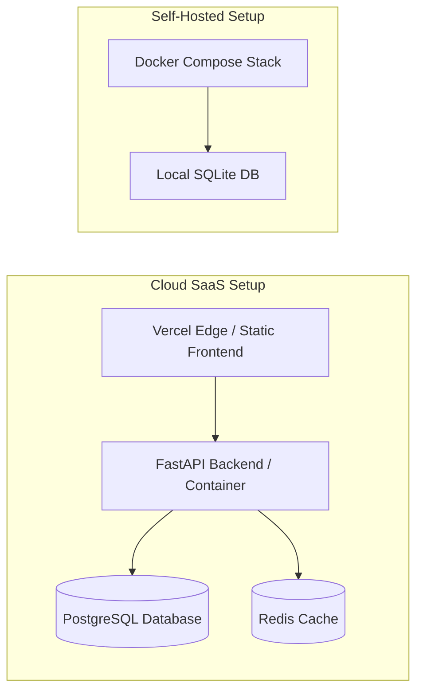

# Deployment & Operations Guide

This guide details deployment options, infrastructure configuration, containerization, and environment management for CommitIQ in production environments.

---

## 🚀 Deployment Topologies

CommitIQ can be deployed in two primary configurations:



---

## 🌐 Production Frontend Deployment (Vercel)

The frontend is optimized for zero-config global edge delivery on **Vercel**:

```bash
cd frontend
npx vercel --prod
```

### Routing & Rewrite Rules (`frontend/vercel.json`)

```json
{
  "rewrites": [
    {
      "source": "/api/:path*",
      "destination": "https://your-backend-api.com/api/:path*"
    },
    {
      "source": "/(.*)",
      "destination": "/index.html"
    }
  ]
}
```

---

## 🐳 Containerization with Docker Compose

For on-premise, self-hosted, or air-gapped environments, CommitIQ provides a single-command Docker Compose stack:

```bash
docker compose up --build -d
```

### Services Defined:

- `backend`: FastAPI async engine running on port `8000`.
- `frontend`: Vite production bundle served via Nginx on port `5173`.
- `db`: Optional PostgreSQL 16 container for enterprise database isolation.

---

## ⚙️ Environment Configuration

| Variable            | Description                                    | Default                                       | Required in Production |
| :------------------ | :--------------------------------------------- | :-------------------------------------------- | :--------------------: |
| `DATABASE_URL`      | Async connection string for SQLAlchemy         | `sqlite+aiosqlite:///./data/commitiq.db`      |        Optional        |
| `GEMINI_API_KEY`    | Google Gemini API key for streaming narratives | `None` (Falls back to deterministic template) |      Recommended       |
| `ANTHROPIC_API_KEY` | Anthropic Claude API key                       | `None`                                        |        Optional        |
| `REDIS_URL`         | Redis connection URL for narrative caching     | `None` (Falls back to in-memory TTL cache)    |        Optional        |
| `CORS_ORIGINS`      | Comma-separated list of allowed CORS domains   | `http://localhost:5173`                       |        **Yes**         |
| `LOG_LEVEL`         | Application logging verbosity                  | `INFO`                                        |           No           |

---

## ⏰ Background Periodic Refresh (APScheduler)

CommitIQ includes an automatic background scheduler that periodically synchronizes metrics for tracked repositories every 24 hours:

- Runs non-blocking background jobs using `AsyncIOScheduler`.
- Automatically identifies registered repositories that have not been re-scanned in >24 hours.
- Re-calculates complexity, churn, and DORA metrics without interrupting active user traffic.
